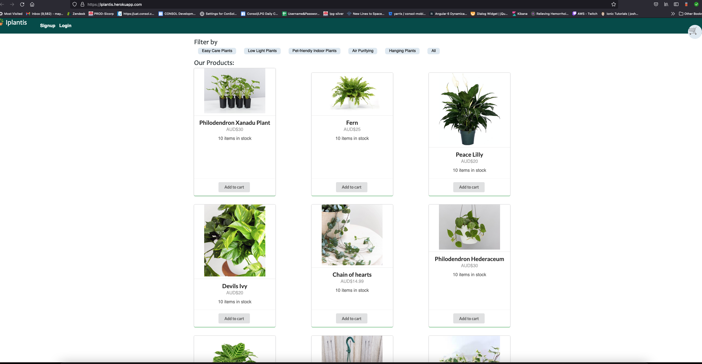

# Iplantis

## Project Description

Online E-commerce single page web appication to buy the plants and get it shipped to your home.

## Tools Used

- React
- Node.js
- Express.js
- GraphQL
- Apollo Server/Apollo Client
- MongoDB and Mongoose
- JSON Web Tokenk
- Semantic UI
- Heroku

## Installation

1. npm run install
2. npm run start:dev

The project will run in the localhost:3000/

## Deployed Application

The application is deployed on Heroku at https://iplantis.herokuapp.com/

## Screenshot

